# RealWorld 앱 설계 문서 (Design Document)

> **버전**: 1.0
> **작성일**: 2025-11-11
> **최종 수정일**: 2025-11-11
> **작성자**: Claude Code

---

## 📋 목차

1. [시스템 개요](#1-시스템-개요)
2. [시스템 아키텍처](#2-시스템-아키텍처)
3. [데이터베이스 설계](#3-데이터베이스-설계)
4. [API 설계](#4-api-설계)
5. [백엔드 아키텍처](#5-백엔드-아키텍처)
6. [프론트엔드 아키텍처](#6-프론트엔드-아키텍처)
7. [보안 설계](#7-보안-설계)
8. [배포 아키텍처](#8-배포-아키텍처)

---

## 1. 시스템 개요

### 1.1 프로젝트 목표

RealWorld 앱은 Medium.com을 모델로 한 소셜 블로깅 플랫폼으로, 다음 목표를 달성합니다:

- **실전 수준의 애플리케이션**: 단순한 투두 앱을 넘어선 실제 프로덕션 수준의 기능 구현
- **모듈화 및 확장성**: 프론트엔드와 백엔드의 완전한 분리, 표준 API 스펙 준수
- **베스트 프랙티스**: 각 기술 스택의 모범 사례를 따르는 코드 구조
- **학습 용이성**: 10분 내에 아키텍처를 파악할 수 있는 단순하면서도 견고한 설계

### 1.2 설계 원칙

1. **단순성과 견고성의 균형**
   - 과도한 엔지니어링 지양
   - 기본 베스트 프랙티스 준수

2. **관심사의 분리 (Separation of Concerns)**
   - 레이어드 아키텍처 적용
   - 각 레이어의 책임 명확화

3. **타입 안정성**
   - TypeScript (프론트엔드)
   - Java/Kotlin (백엔드)

4. **테스트 가능성**
   - 단위 테스트 및 통합 테스트 작성 용이
   - 의존성 주입 활용

5. **보안 우선**
   - JWT 기반 인증
   - 비밀번호 암호화
   - CORS 설정

---

## 2. 시스템 아키텍처

### 2.1 전체 시스템 아키텍처

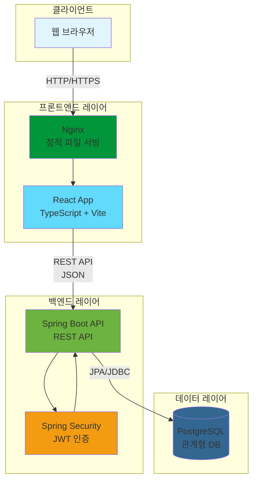

### 2.2 주요 컴포넌트

| 컴포넌트 | 기술 스택 | 역할 |
|---------|----------|------|
| **프론트엔드** | React 18 + TypeScript + Vite | UI 렌더링, 사용자 인터랙션 처리 |
| **웹 서버** | Nginx | 정적 파일 서빙, 리버스 프록시 |
| **API 서버** | Spring Boot 3.x | 비즈니스 로직, REST API 제공 |
| **인증** | Spring Security + JWT | 사용자 인증 및 권한 관리 |
| **데이터베이스** | PostgreSQL 14+ | 데이터 영속성 |

### 2.3 통신 흐름

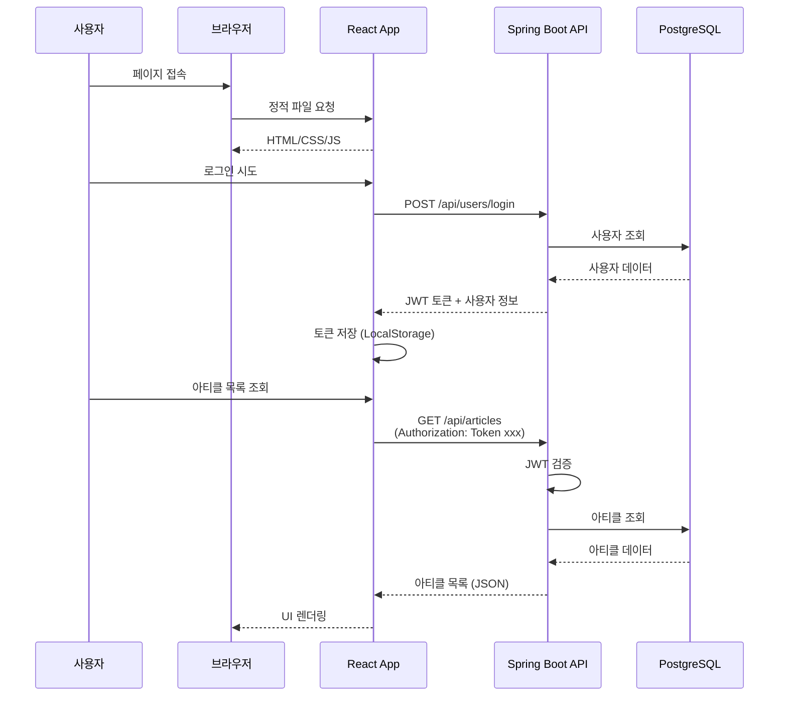

---

## 3. 데이터베이스 설계

### 3.1 ERD (Entity Relationship Diagram)

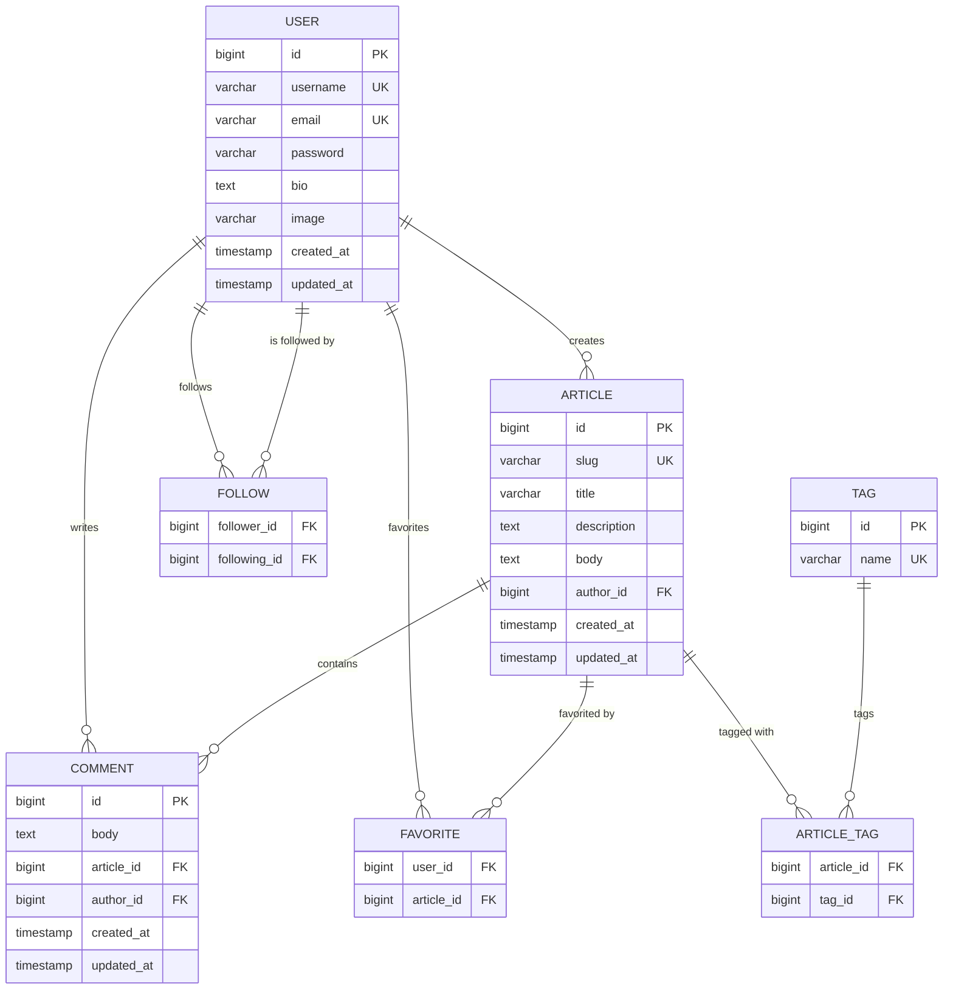

### 3.2 테이블 상세 스키마

#### 3.2.1 users 테이블

| 컬럼명 | 타입 | 제약조건 | 설명 |
|--------|------|---------|------|
| id | BIGINT | PRIMARY KEY, AUTO_INCREMENT | 사용자 고유 ID |
| username | VARCHAR(100) | UNIQUE, NOT NULL | 사용자명 (고유) |
| email | VARCHAR(255) | UNIQUE, NOT NULL | 이메일 (고유) |
| password | VARCHAR(255) | NOT NULL | 암호화된 비밀번호 (BCrypt) |
| bio | TEXT | NULL | 자기소개 |
| image | VARCHAR(500) | NULL | 프로필 이미지 URL |
| created_at | TIMESTAMP | NOT NULL, DEFAULT CURRENT_TIMESTAMP | 생성 시간 |
| updated_at | TIMESTAMP | NOT NULL, DEFAULT CURRENT_TIMESTAMP | 수정 시간 |

**인덱스:**
- `idx_users_email` on (email)
- `idx_users_username` on (username)

---

#### 3.2.2 articles 테이블

| 컬럼명 | 타입 | 제약조건 | 설명 |
|--------|------|---------|------|
| id | BIGINT | PRIMARY KEY, AUTO_INCREMENT | 아티클 고유 ID |
| slug | VARCHAR(255) | UNIQUE, NOT NULL | URL-friendly 제목 |
| title | VARCHAR(255) | NOT NULL | 아티클 제목 |
| description | TEXT | NOT NULL | 아티클 요약 |
| body | TEXT | NOT NULL | 아티클 본문 (마크다운) |
| author_id | BIGINT | FOREIGN KEY → users(id), NOT NULL | 작성자 ID |
| created_at | TIMESTAMP | NOT NULL, DEFAULT CURRENT_TIMESTAMP | 생성 시간 |
| updated_at | TIMESTAMP | NOT NULL, DEFAULT CURRENT_TIMESTAMP | 수정 시간 |

**인덱스:**
- `idx_articles_slug` on (slug)
- `idx_articles_author_id` on (author_id)
- `idx_articles_created_at` on (created_at DESC)

---

#### 3.2.3 comments 테이블

| 컬럼명 | 타입 | 제약조건 | 설명 |
|--------|------|---------|------|
| id | BIGINT | PRIMARY KEY, AUTO_INCREMENT | 댓글 고유 ID |
| body | TEXT | NOT NULL | 댓글 내용 |
| article_id | BIGINT | FOREIGN KEY → articles(id), NOT NULL | 아티클 ID |
| author_id | BIGINT | FOREIGN KEY → users(id), NOT NULL | 작성자 ID |
| created_at | TIMESTAMP | NOT NULL, DEFAULT CURRENT_TIMESTAMP | 생성 시간 |
| updated_at | TIMESTAMP | NOT NULL, DEFAULT CURRENT_TIMESTAMP | 수정 시간 |

**인덱스:**
- `idx_comments_article_id` on (article_id)
- `idx_comments_author_id` on (author_id)

---

#### 3.2.4 tags 테이블

| 컬럼명 | 타입 | 제약조건 | 설명 |
|--------|------|---------|------|
| id | BIGINT | PRIMARY KEY, AUTO_INCREMENT | 태그 고유 ID |
| name | VARCHAR(100) | UNIQUE, NOT NULL | 태그 이름 |

**인덱스:**
- `idx_tags_name` on (name)

---

#### 3.2.5 article_tags 테이블 (조인 테이블)

| 컬럼명 | 타입 | 제약조건 | 설명 |
|--------|------|---------|------|
| article_id | BIGINT | FOREIGN KEY → articles(id), NOT NULL | 아티클 ID |
| tag_id | BIGINT | FOREIGN KEY → tags(id), NOT NULL | 태그 ID |

**복합 기본 키:** (article_id, tag_id)

**인덱스:**
- `idx_article_tags_article_id` on (article_id)
- `idx_article_tags_tag_id` on (tag_id)

---

#### 3.2.6 favorites 테이블

| 컬럼명 | 타입 | 제약조건 | 설명 |
|--------|------|---------|------|
| user_id | BIGINT | FOREIGN KEY → users(id), NOT NULL | 사용자 ID |
| article_id | BIGINT | FOREIGN KEY → articles(id), NOT NULL | 아티클 ID |

**복합 기본 키:** (user_id, article_id)

**인덱스:**
- `idx_favorites_user_id` on (user_id)
- `idx_favorites_article_id` on (article_id)

---

#### 3.2.7 follows 테이블

| 컬럼명 | 타입 | 제약조건 | 설명 |
|--------|------|---------|------|
| follower_id | BIGINT | FOREIGN KEY → users(id), NOT NULL | 팔로워 ID |
| following_id | BIGINT | FOREIGN KEY → users(id), NOT NULL | 팔로잉 ID |

**복합 기본 키:** (follower_id, following_id)

**제약조건:**
- CHECK (follower_id != following_id) - 자기 자신을 팔로우할 수 없음

**인덱스:**
- `idx_follows_follower_id` on (follower_id)
- `idx_follows_following_id` on (following_id)

---

### 3.3 데이터베이스 관계 요약

| 관계 | 타입 | 설명 |
|------|------|------|
| User → Article | 1:N | 한 사용자는 여러 아티클 작성 가능 |
| User → Comment | 1:N | 한 사용자는 여러 댓글 작성 가능 |
| Article → Comment | 1:N | 한 아티클에 여러 댓글 가능 |
| Article ↔ Tag | N:M | 아티클과 태그는 다대다 관계 |
| User ↔ Article (Favorite) | N:M | 사용자와 아티클 좋아요는 다대다 관계 |
| User ↔ User (Follow) | N:M | 사용자 간 팔로우는 다대다 자기참조 관계 |

---

## 4. API 설계

### 4.1 API 개요

- **프로토콜**: HTTP/HTTPS
- **포맷**: JSON
- **인증**: JWT (JSON Web Token)
- **베이스 URL**: `http://localhost:8080/api`

### 4.2 인증 헤더

```
Authorization: Token {jwt-token}
```

### 4.3 API 엔드포인트 목록

#### 4.3.1 인증 (Authentication)

| 메서드 | 엔드포인트 | 인증 필요 | 설명 |
|--------|-----------|---------|------|
| POST | `/api/users/login` | ❌ | 로그인 |
| POST | `/api/users` | ❌ | 회원가입 |
| GET | `/api/user` | ✅ | 현재 사용자 정보 조회 |
| PUT | `/api/user` | ✅ | 사용자 정보 수정 |

#### 4.3.2 프로필 (Profiles)

| 메서드 | 엔드포인트 | 인증 필요 | 설명 |
|--------|-----------|---------|------|
| GET | `/api/profiles/:username` | 선택 | 프로필 조회 |
| POST | `/api/profiles/:username/follow` | ✅ | 팔로우 |
| DELETE | `/api/profiles/:username/follow` | ✅ | 언팔로우 |

#### 4.3.3 아티클 (Articles)

| 메서드 | 엔드포인트 | 인증 필요 | 설명 |
|--------|-----------|---------|------|
| GET | `/api/articles` | 선택 | 아티클 목록 조회 |
| GET | `/api/articles/feed` | ✅ | 팔로우한 사용자의 피드 |
| GET | `/api/articles/:slug` | 선택 | 아티클 상세 조회 |
| POST | `/api/articles` | ✅ | 아티클 작성 |
| PUT | `/api/articles/:slug` | ✅ | 아티클 수정 |
| DELETE | `/api/articles/:slug` | ✅ | 아티클 삭제 |

#### 4.3.4 댓글 (Comments)

| 메서드 | 엔드포인트 | 인증 필요 | 설명 |
|--------|-----------|---------|------|
| GET | `/api/articles/:slug/comments` | 선택 | 댓글 목록 조회 |
| POST | `/api/articles/:slug/comments` | ✅ | 댓글 작성 |
| DELETE | `/api/articles/:slug/comments/:id` | ✅ | 댓글 삭제 |

#### 4.3.5 좋아요 (Favorites)

| 메서드 | 엔드포인트 | 인증 필요 | 설명 |
|--------|-----------|---------|------|
| POST | `/api/articles/:slug/favorite` | ✅ | 아티클 좋아요 |
| DELETE | `/api/articles/:slug/favorite` | ✅ | 아티클 좋아요 취소 |

#### 4.3.6 태그 (Tags)

| 메서드 | 엔드포인트 | 인증 필요 | 설명 |
|--------|-----------|---------|------|
| GET | `/api/tags` | ❌ | 태그 목록 조회 |

### 4.4 API 요청/응답 예시

#### 4.4.1 로그인 (POST /api/users/login)

**요청:**
```json
{
  "user": {
    "email": "user@example.com",
    "password": "password123"
  }
}
```

**응답 (200 OK):**
```json
{
  "user": {
    "email": "user@example.com",
    "token": "jwt.token.here",
    "username": "johndoe",
    "bio": "I love coding",
    "image": "https://example.com/avatar.jpg"
  }
}
```

---

#### 4.4.2 아티클 목록 조회 (GET /api/articles)

**쿼리 파라미터:**
- `limit` (기본값: 20) - 페이지 크기
- `offset` (기본값: 0) - 오프셋
- `tag` - 태그 필터
- `author` - 작성자 필터
- `favorited` - 좋아요한 사용자 필터

**응답 (200 OK):**
```json
{
  "articles": [
    {
      "slug": "how-to-train-your-dragon",
      "title": "How to train your dragon",
      "description": "Ever wonder how?",
      "body": "It takes a Jacobian",
      "tagList": ["dragons", "training"],
      "createdAt": "2016-02-18T03:22:56.637Z",
      "updatedAt": "2016-02-18T03:48:35.824Z",
      "favorited": false,
      "favoritesCount": 0,
      "author": {
        "username": "jake",
        "bio": "I work at statefarm",
        "image": "https://i.stack.imgur.com/xHWG8.jpg",
        "following": false
      }
    }
  ],
  "articlesCount": 1
}
```

---

#### 4.4.3 에러 응답

**응답 (422 Unprocessable Entity):**
```json
{
  "errors": {
    "body": [
      "can't be empty"
    ]
  }
}
```

---

## 5. 백엔드 아키텍처

### 5.1 레이어드 아키텍처

```mermaid
graph TB
    subgraph "Presentation Layer"
        Controller[Controller<br/>@RestController]
    end

    subgraph "Application Layer"
        Service[Service<br/>@Service]
        DTO[DTO<br/>Request/Response]
    end

    subgraph "Domain Layer"
        Entity[Entity<br/>@Entity]
        Repository[Repository<br/>@Repository]
    end

    subgraph "Infrastructure Layer"
        DB[(PostgreSQL)]
        Security[Spring Security<br/>JWT Filter]
    end

    Controller --> DTO
    Controller --> Service
    Service --> Entity
    Service --> Repository
    Repository --> DB
    Controller --> Security
    Security --> Service

    style Controller fill:#61dafb
    style Service fill:#ffd700
    style Entity fill:#90ee90
    style Repository fill:#ffb6c1
    style DB fill:#336791
    style Security fill:#f39c12
```

### 5.2 패키지 구조

```
backend/
└── src/
    └── main/
        └── java/
            └── io/realworld/
                ├── api/                    # Presentation Layer
                │   ├── controller/         # REST 컨트롤러
                │   ├── dto/                # 요청/응답 DTO
                │   └── exception/          # 글로벌 예외 핸들러
                │
                ├── domain/                 # Domain Layer
                │   ├── user/
                │   │   ├── User.java       # Entity
                │   │   ├── UserRepository.java
                │   │   └── UserService.java
                │   ├── article/
                │   │   ├── Article.java
                │   │   ├── ArticleRepository.java
                │   │   └── ArticleService.java
                │   └── ...
                │
                ├── security/               # Infrastructure Layer
                │   ├── JwtTokenProvider.java
                │   ├── JwtAuthenticationFilter.java
                │   └── SecurityConfig.java
                │
                └── config/                 # Configuration
                    ├── WebConfig.java
                    └── OpenApiConfig.java
```

### 5.3 JWT 인증 흐름

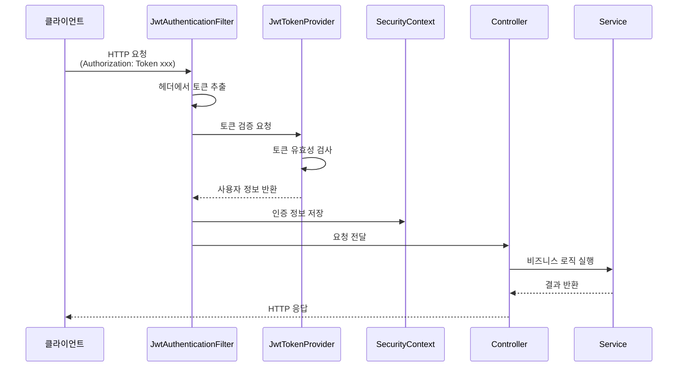

### 5.4 주요 컴포넌트 설명

#### 5.4.1 Controller (컨트롤러)
- **역할**: HTTP 요청을 받아 Service로 전달하고 응답 반환
- **책임**: 요청 검증, 응답 포맷팅
- **예시**: `UserController`, `ArticleController`

#### 5.4.2 Service (서비스)
- **역할**: 비즈니스 로직 처리
- **책임**: 트랜잭션 관리, 도메인 로직 조합
- **예시**: `UserService`, `ArticleService`

#### 5.4.3 Repository (리포지토리)
- **역할**: 데이터베이스 접근
- **책임**: CRUD 작업, 쿼리 실행
- **기술**: Spring Data JPA

#### 5.4.4 Entity (엔티티)
- **역할**: 데이터베이스 테이블 매핑
- **책임**: 도메인 모델 표현
- **예시**: `User`, `Article`, `Comment`

#### 5.4.5 DTO (Data Transfer Object)
- **역할**: 계층 간 데이터 전송
- **책임**: API 요청/응답 구조 정의
- **예시**: `LoginRequest`, `ArticleResponse`

---

## 6. 프론트엔드 아키텍처

### 6.1 컴포넌트 구조

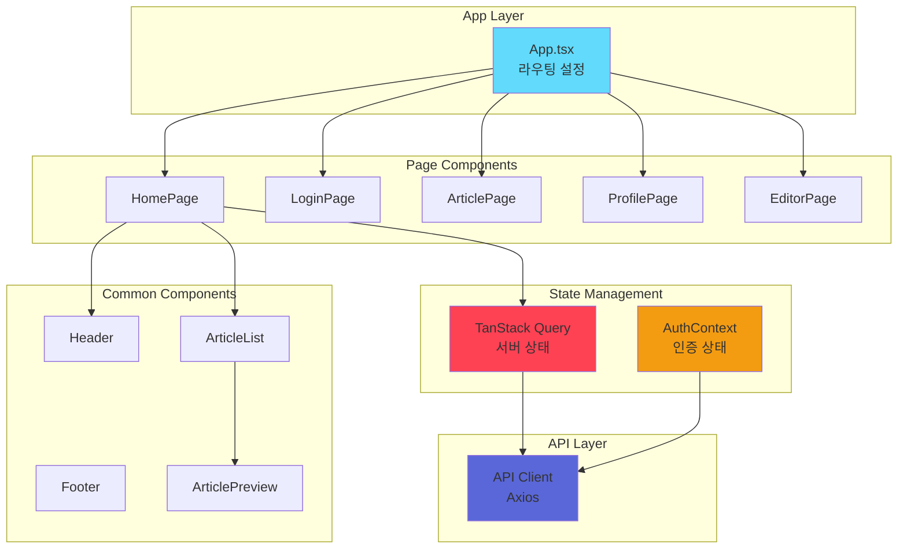

### 6.2 디렉토리 구조

```
frontend/
└── src/
    ├── components/          # 재사용 가능한 컴포넌트
    │   ├── common/
    │   │   ├── Header.tsx
    │   │   ├── Button.tsx
    │   │   └── Input.tsx
    │   ├── article/
    │   │   ├── ArticleList.tsx
    │   │   ├── ArticlePreview.tsx
    │   │   └── ArticleMeta.tsx
    │   └── comment/
    │       ├── CommentList.tsx
    │       └── CommentForm.tsx
    │
    ├── pages/               # 페이지 컴포넌트
    │   ├── HomePage.tsx
    │   ├── LoginPage.tsx
    │   ├── ArticlePage.tsx
    │   ├── ProfilePage.tsx
    │   └── EditorPage.tsx
    │
    ├── api/                 # API 클라이언트
    │   ├── axios.ts         # Axios 인스턴스
    │   ├── auth.ts          # 인증 API
    │   ├── articles.ts      # 아티클 API
    │   └── users.ts         # 사용자 API
    │
    ├── hooks/               # 커스텀 훅
    │   ├── useAuth.ts
    │   ├── useArticles.ts
    │   └── useComments.ts
    │
    ├── context/             # Context API
    │   └── AuthContext.tsx
    │
    ├── types/               # TypeScript 타입 정의
    │   ├── user.ts
    │   ├── article.ts
    │   └── api.ts
    │
    ├── utils/               # 유틸리티 함수
    │   ├── storage.ts       # LocalStorage 관리
    │   └── format.ts        # 포맷팅 함수
    │
    ├── App.tsx              # 앱 진입점
    └── main.tsx             # React 렌더링
```

### 6.3 상태 관리 전략

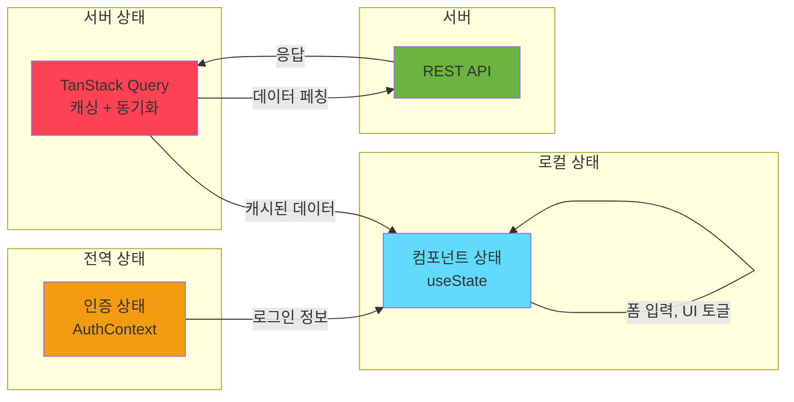

### 6.4 라우팅 구조

| 경로 | 컴포넌트 | 인증 필요 | 설명 |
|------|---------|---------|------|
| `/` | HomePage | ❌ | 홈 페이지 (아티클 목록) |
| `/login` | LoginPage | ❌ | 로그인 페이지 |
| `/register` | RegisterPage | ❌ | 회원가입 페이지 |
| `/settings` | SettingsPage | ✅ | 설정 페이지 |
| `/editor` | EditorPage | ✅ | 아티클 작성 페이지 |
| `/editor/:slug` | EditorPage | ✅ | 아티클 수정 페이지 |
| `/article/:slug` | ArticlePage | ❌ | 아티클 상세 페이지 |
| `/profile/:username` | ProfilePage | ❌ | 프로필 페이지 |
| `/profile/:username/favorites` | ProfilePage | ❌ | 좋아요한 아티클 페이지 |

---

## 7. 보안 설계

### 7.1 인증 메커니즘 (JWT)

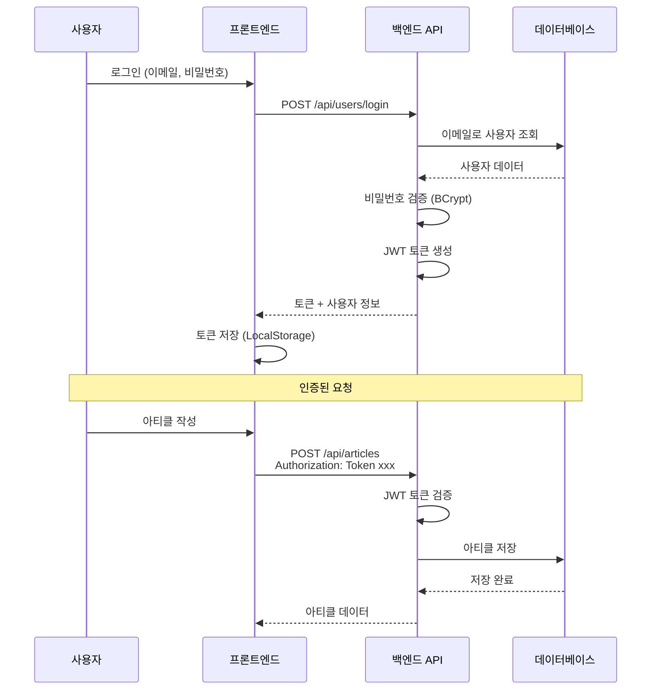

### 7.2 보안 고려사항

#### 7.2.1 인증 및 권한

| 항목 | 구현 방법 |
|------|----------|
| **비밀번호 저장** | BCrypt 해싱 (Salt + Hash) |
| **토큰 방식** | JWT (JSON Web Token) |
| **토큰 저장** | LocalStorage (프론트엔드) |
| **토큰 만료** | 24시간 (설정 가능) |
| **토큰 검증** | JwtAuthenticationFilter (백엔드) |

#### 7.2.2 API 보안

| 항목 | 구현 방법 |
|------|----------|
| **CORS** | Spring Security CORS 설정 |
| **CSRF** | JWT 사용으로 CSRF 비활성화 |
| **XSS 방지** | 입력 검증, 출력 인코딩 |
| **SQL Injection 방지** | Prepared Statement (JPA) |
| **Rate Limiting** | (선택) Spring Cloud Gateway |

#### 7.2.3 권한 관리

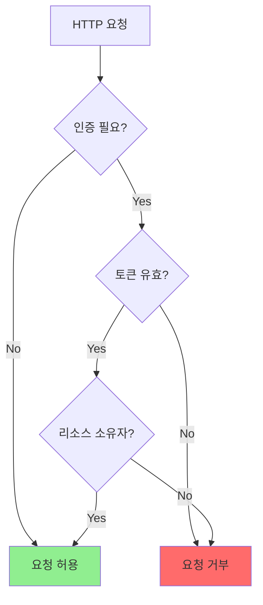

**권한 검증 규칙:**
- 아티클 수정/삭제: 작성자만 가능
- 댓글 삭제: 작성자만 가능
- 프로필 수정: 본인만 가능

---

## 8. 배포 아키텍처

### 8.1 Docker 컨테이너 구성

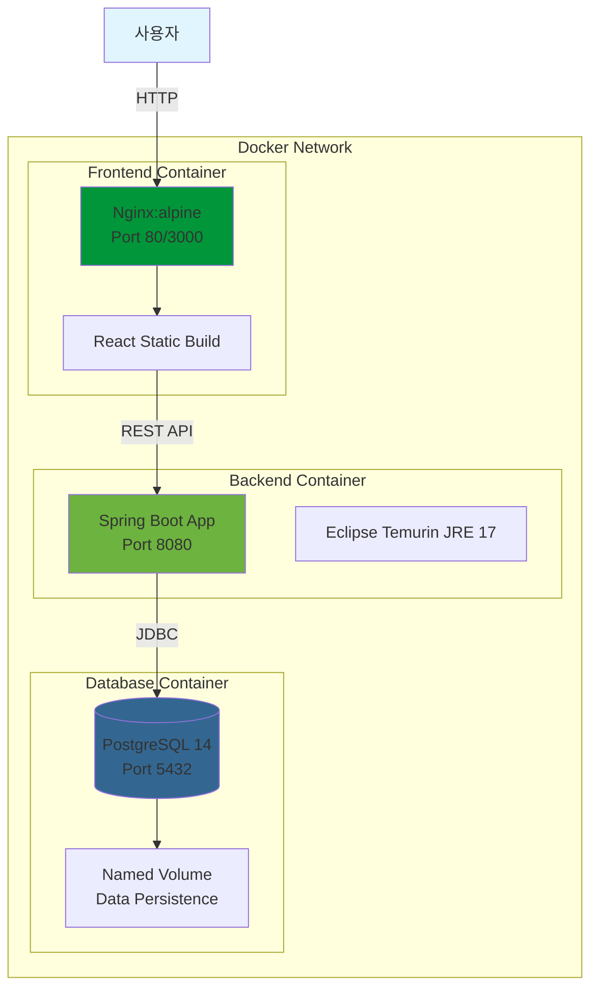

### 8.2 Docker Compose 구성

```yaml
services:
  # PostgreSQL 데이터베이스
  db:
    image: postgres:14-alpine
    ports:
      - "5432:5432"
    environment:
      - POSTGRES_DB=realworld
      - POSTGRES_USER=postgres
      - POSTGRES_PASSWORD=password
    volumes:
      - postgres_data:/var/lib/postgresql/data
    healthcheck:
      test: ["CMD-SHELL", "pg_isready -U postgres"]
      interval: 10s
      timeout: 5s
      retries: 5

  # Spring Boot 백엔드
  backend:
    build: ./backend
    ports:
      - "8080:8080"
    environment:
      - DATABASE_URL=jdbc:postgresql://db:5432/realworld
      - DATABASE_USERNAME=postgres
      - DATABASE_PASSWORD=password
      - JWT_SECRET=your-secret-key
      - JWT_EXPIRATION=86400000
    depends_on:
      db:
        condition: service_healthy

  # React 프론트엔드
  frontend:
    build: ./frontend
    ports:
      - "3000:80"
    environment:
      - VITE_API_URL=http://localhost:8080/api
    depends_on:
      - backend

volumes:
  postgres_data:
```

### 8.3 환경별 배포 전략

#### 8.3.1 개발 환경 (Development)

- **특징**: Hot Reload, 상세한 로그
- **실행**: `docker-compose -f docker-compose.dev.yml up`
- **환경 변수**: `.env.dev`

#### 8.3.2 프로덕션 환경 (Production)

- **특징**: 최적화된 빌드, HTTPS, 환경 변수 암호화
- **실행**: `docker-compose -f docker-compose.prod.yml up -d`
- **환경 변수**: `.env.prod` (암호화된 값)

### 8.4 CI/CD 파이프라인 (선택)

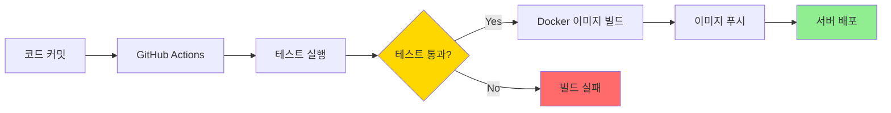

---

## 9. 성능 및 확장성 고려사항

### 9.1 성능 최적화

#### 9.1.1 백엔드

- **데이터베이스 인덱싱**: 자주 조회되는 컬럼에 인덱스 추가
- **N+1 쿼리 방지**: `@EntityGraph` 또는 `JOIN FETCH` 사용
- **페이지네이션**: 대량 데이터 조회 시 필수
- **캐싱**: (선택) Redis를 활용한 세션 캐싱

#### 9.1.2 프론트엔드

- **코드 스플리팅**: React.lazy + Suspense
- **이미지 최적화**: WebP 포맷, Lazy Loading
- **TanStack Query 캐싱**: staleTime, cacheTime 설정
- **번들 최적화**: Vite 빌드 최적화

### 9.2 확장성 전략

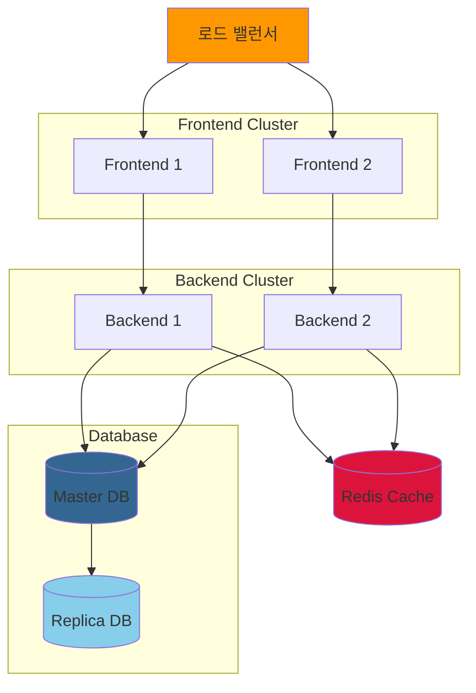

---

## 10. 테스트 전략

### 10.1 테스트 피라미드

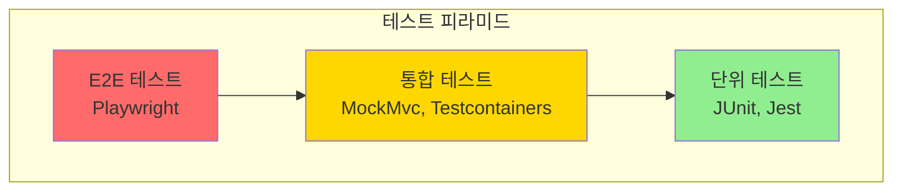

### 10.2 테스트 범위

#### 10.2.1 백엔드

- **단위 테스트**: Service, Repository, Utility
- **통합 테스트**: Controller, API, 데이터베이스
- **Testcontainers**: PostgreSQL 테스트 컨테이너

#### 10.2.2 프론트엔드

- **컴포넌트 테스트**: React Testing Library
- **E2E 테스트**: Playwright 또는 Cypress
- **API Mocking**: MSW (Mock Service Worker)

---

## 11. 모니터링 및 로깅

### 11.1 로깅 전략

| 레벨 | 용도 | 예시 |
|------|------|------|
| **ERROR** | 시스템 오류 | 데이터베이스 연결 실패 |
| **WARN** | 경고 | 비정상적인 사용자 행동 |
| **INFO** | 일반 정보 | API 요청 로그 |
| **DEBUG** | 디버그 정보 | 변수 값, 실행 흐름 |

### 11.2 모니터링 (선택)

- **애플리케이션 모니터링**: Spring Boot Actuator
- **로그 수집**: ELK Stack (Elasticsearch, Logstash, Kibana)
- **메트릭 수집**: Prometheus + Grafana

---

## 12. 참고 자료

- **RealWorld 공식 문서**: https://realworld-docs.netlify.app/
- **RealWorld 구현 가이드**: https://docs.realworld.show/
- **Spring Boot 문서**: https://spring.io/projects/spring-boot
- **React 문서**: https://react.dev/
- **TanStack Query 문서**: https://tanstack.com/query/latest

---

## 문서 버전

- **버전**: 1.0
- **작성일**: 2025-11-11
- **최종 수정일**: 2025-11-11
- **작성자**: Claude Code

---

**이 설계 문서는 구현 과정에서 지속적으로 업데이트됩니다.**
